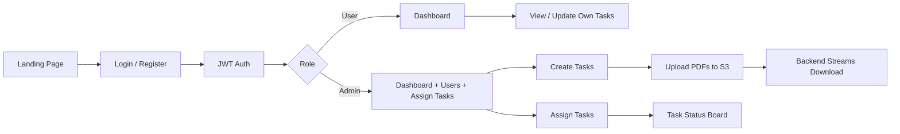
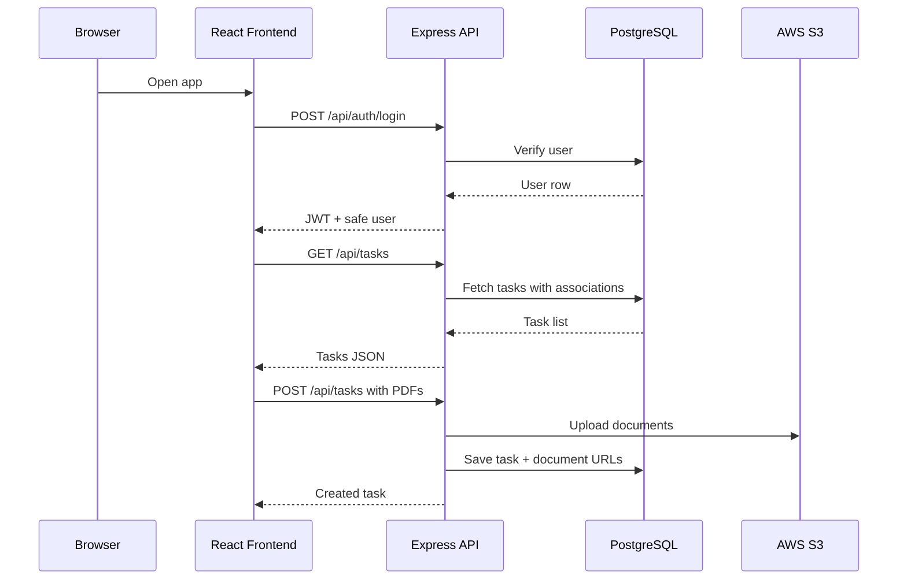
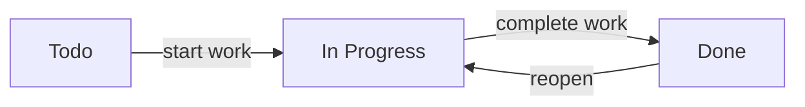
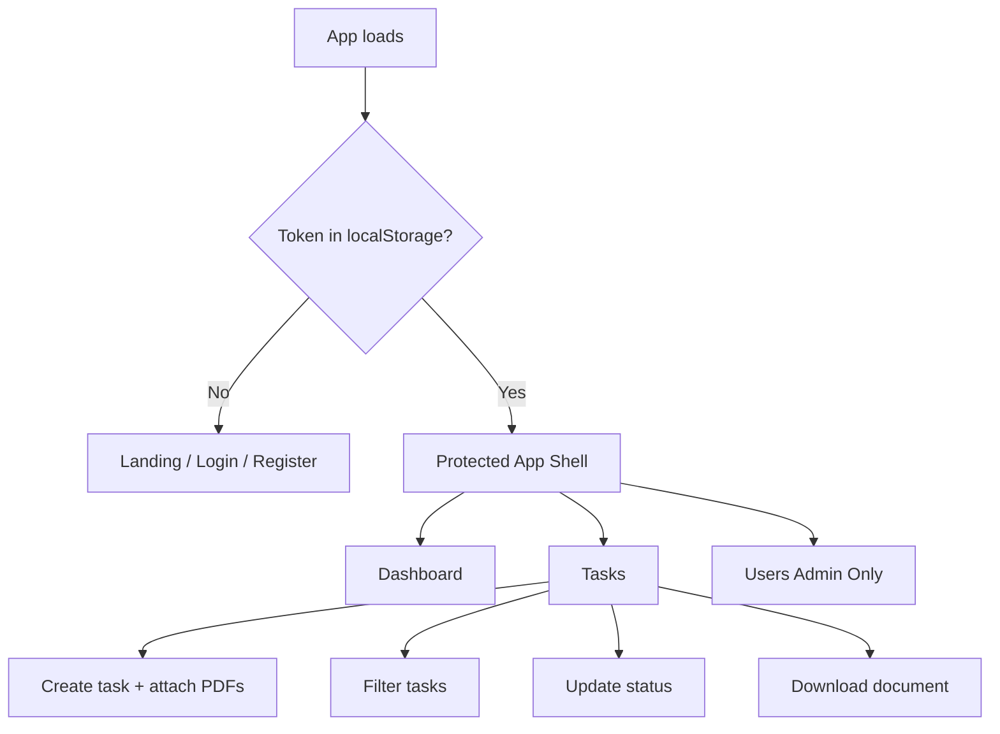
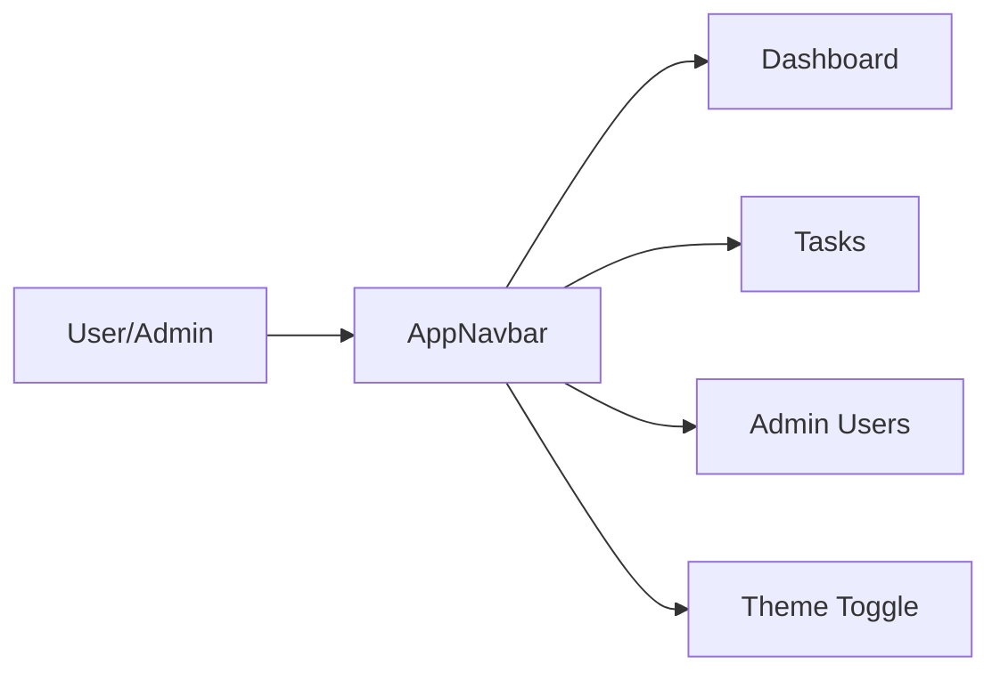
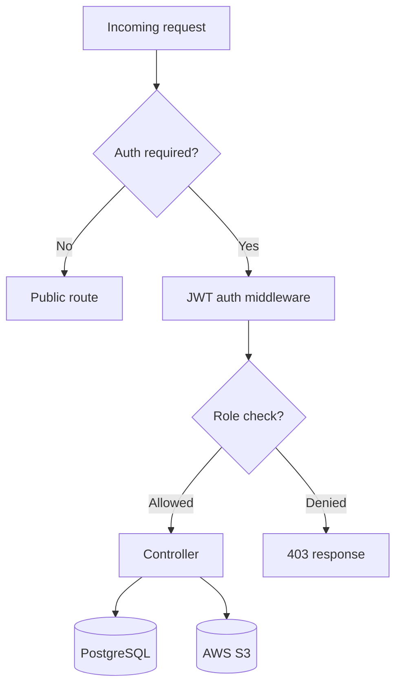

# TaskFlow

TaskFlow is a full-stack task management system with role-based access, AWS S3 document uploads, PDF streaming, dark mode, admin user management, and Docker-based deployment.

It is built with:
- Backend: Node.js, Express, Sequelize, PostgreSQL, JWT, bcrypt
- Frontend: React, Vite, Tailwind CSS, Framer Motion, React Router
- Storage: AWS S3 for task attachments
- Deployment: Docker, Docker Compose, GitHub Actions, EC2

## What It Does

- Public landing page with login and registration entry points
- JWT authentication with protected routes
- Role-based access for `User` and `Admin`
- Admin-only user registry and user deletion
- Task creation, assignment, filtering, update, and deletion
- Status control for assignee and assigning admin
- PDF upload to S3 and inline download streaming through the backend
- Glassmorphism UI, responsive layout, and dark mode

## Visual Overview







## Role and Permission Model

| Role | What they can do |
| --- | --- |
| Guest | View landing page, register, log in |
| User | View assigned tasks, update task status when allowed, download attachments |
| Admin | Create and assign tasks, view all tasks, manage users, update status on assigned tasks |

## Main Screens

| Screen | Purpose |
| --- | --- |
| Landing | Marketing-style entry page with login and register access |
| Login | Authenticate and enter the dashboard |
| Register | Create a new user account |
| Dashboard | Task metrics and quick status board |
| Tasks | Create, assign, filter, update, delete tasks, and access PDFs |
| Users | Admin-only user registry and deletion |

## API Reference

All backend routes are mounted under `/api`.

### Health / Base

| Method | Endpoint | Auth | Description |
| --- | --- | --- | --- |
| GET | `/` | No | Simple health response: `Task Manager API is up and running` |

### Auth APIs

| Method | Endpoint | Auth | Request Body | Description |
| --- | --- | --- | --- | --- |
| POST | `/api/auth/register` | No | `{ email, password, role? }` | Creates a user account |
| POST | `/api/auth/login` | No | `{ email, password }` | Returns JWT token and safe user data |

### Task APIs

| Method | Endpoint | Auth | Access | Request Body / Query | Description |
| --- | --- | --- | --- | --- | --- |
| GET | `/api/tasks` | Yes | User/Admin | Query: `status`, `priority`, `sortBy`, `order`, `page`, `limit` | Lists tasks visible to the current user |
| GET | `/api/tasks/:id` | Yes | User/Admin | Path param `id` | Returns task data using the task list handler |
| POST | `/api/tasks` | Yes | User/Admin | Multipart form-data: `title`, `description`, `status`, `priority`, `dueDate`, `assignedTo`, `documents[]` | Creates a task and uploads up to 3 PDFs |
| PUT | `/api/tasks/:id` | Yes | Assignee or assigning admin | Multipart form-data / JSON | Updates task fields and attachments |
| PATCH | `/api/tasks/:id/status` | Yes | Assignee or assigning admin | `{ status }` | Updates only the task status |
| DELETE | `/api/tasks/:id` | Yes | User/Admin | Path param `id` | Deletes a task |
| GET | `/api/tasks/download` | No | Public stream endpoint | Query: `url` | Streams a private S3 PDF inline through the backend |

### User APIs

| Method | Endpoint | Auth | Access | Description |
| --- | --- | --- | --- | --- |
| GET | `/api/users` | Yes | Admin only | Lists all users with safe fields |
| DELETE | `/api/users/:id` | Yes | Admin only | Deletes a user by id |

### Admin CRUD Router

There is also an admin-only router in `backend/routes/roleMiddleware.js` that protects user management operations behind authentication and the `Admin` role.

| Method | Endpoint | Access | Description |
| --- | --- | --- | --- |
| GET | `/` | Admin only | List all users |
| POST | `/` | Admin only | Create a user |
| PUT | `/:id` | Admin only | Update a user |
| DELETE | `/:id` | Admin only | Delete a user |
| GET | `/:id` | Admin only | Fetch a user by id |

## Frontend Flow





## Backend Flow



## Environment Variables

### Backend

| Variable | Purpose |
| --- | --- |
| `PORT` | API port, defaults to `5000` |
| `DB_HOST` | PostgreSQL host |
| `DB_PORT` | PostgreSQL port |
| `DB_USER` | Database user |
| `DB_PASS` / `DB_PASSWORD` | Database password |
| `DB_NAME` | Database name |
| `JWT_SECRET` | JWT signing secret |
| `AWS_REGION` | S3 region |
| `AWS_ACCESS_KEY_ID` / `AWS_ACCESS_KEY` | AWS access key |
| `AWS_SECRET_ACCESS_KEY` / `AWS_SECRET_KEY` | AWS secret key |
| `AWS_BUCKET_NAME` | S3 bucket for task documents |
| `CORS_ORIGIN` | Allowed frontend origin(s) |
| `FRONTEND_URL` | Optional frontend origin fallback |

### Frontend

| Variable | Purpose |
| --- | --- |
| `VITE_API_BASE_URL` | Overrides API base URL in development or custom setups |

In production the frontend uses `/api` so nginx can proxy requests to the backend.

## Local Setup

### 1. Install dependencies

```bash
npm install
cd backend && npm install
cd ../frontend && npm install
```

### 2. Configure backend env

Create `backend/.env` with the required database, JWT, and AWS values.

Example:

```env
PORT=5000
DB_HOST=localhost
DB_PORT=5432
DB_USER=postgres
DB_PASS=password
DB_NAME=taskmanager
JWT_SECRET=replace-me
AWS_REGION=ap-south-1
AWS_ACCESS_KEY_ID=your-key
AWS_SECRET_ACCESS_KEY=your-secret
AWS_BUCKET_NAME=your-bucket
CORS_ORIGIN=http://localhost:5174
```

### 3. Run the app locally

Backend:

```bash
npm run dev
```

Frontend:

```bash
cd frontend
npm run dev
```

## Docker Setup

### Development database

```bash
docker compose up -d
```

### Production stack

Use `docker-compose.prod.yml` with the remapped host ports:

- Frontend: `8080`
- Backend: `5001`

```bash
docker compose -f docker-compose.prod.yml up -d --build
```

## Deployment Notes

- The frontend build must use Node 20+ because the current Vite toolchain expects a newer runtime.
- Production frontend traffic should be routed through nginx and `/api`.
- The backend streams PDFs from S3; do not expose raw S3 URLs for private objects.
- If another process already uses host ports `80` or `5000`, use the alternate production ports defined in `docker-compose.prod.yml`.

## Project Structure

```text
fsd-intern-task/
├── backend/
│   ├── config/
│   ├── controllers/
│   ├── middleware/
│   ├── models/
│   ├── routes/
│   └── server.js
├── frontend/
│   ├── src/
│   │   ├── api/
│   │   ├── components/
│   │   ├── context/
│   │   ├── layouts/
│   │   └── pages/
│   └── Dockerfile
├── docker-compose.yml
├── docker-compose.prod.yml
└── .github/workflows/deploy.yml
```

## UX Notes

- Landing page uses a split layout with marketing content on the left and compact login on the right.
- Protected app views use a glassmorphism navbar with role-aware navigation.
- Theme toggle persists the selected mode.
- Toasts provide lightweight feedback for destructive actions and optimistic updates.
- The UI is responsive across desktop and mobile breakpoints.

## Common Troubleshooting

| Symptom | Likely Cause | Fix |
| --- | --- | --- |
| Login/register hits `localhost:5000` in production | Stale frontend bundle or custom env override | Rebuild the frontend image and clear browser cache |
| `403 Access denied` on admin pages | Non-admin user or expired token | Log in as Admin and confirm JWT state |
| PDF download opens broken link | Raw S3 URL used instead of backend stream endpoint | Use `/api/tasks/download?url=...` |
| Workflow SSH failure | Wrong key, username, or deploy path | Verify GitHub Secrets and EC2 authorized keys |

## API Summary at a Glance

| Area | Endpoints |
| --- | --- |
| Auth | `/api/auth/register`, `/api/auth/login` |
| Tasks | `/api/tasks`, `/api/tasks/:id`, `/api/tasks/:id/status`, `/api/tasks/download` |
| Users | `/api/users`, `/api/users/:id` |
| Health | `/` |
